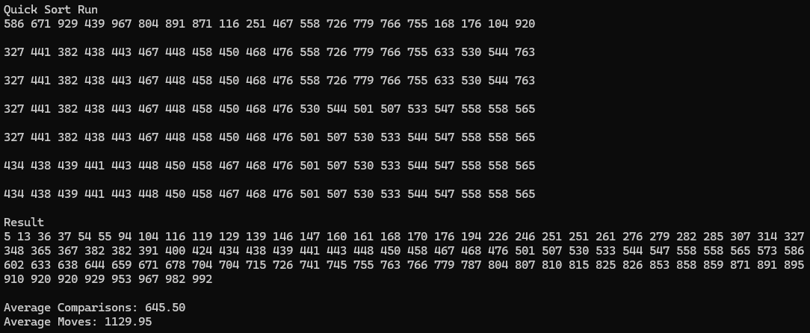

{Result Image}

# 결과분석

| 알고리즘 | 평균 | 최악 | 최선 | 제자리 | 안정적 |
| :-:  | :-: | :-:  | :-: | :-:  | :-: | 
| 선택 | O(n²) | O(n²) | O(n²) | 가능 | 불안정 |
| 삽입 | O(n²) | O(n²) | O(n) | 가능 | 안정 |
| 버블 | O(n²) | O(n²) | O(n²) | 가능 | 안정 |
| 쉘 | O(n^3/2) | O(n²) | O(n^(3/2)) | 가능 | 불안정 |
| 합병 | O(n log n) | O(n log n) | O(n log n) | 불가능 | 안정 | 
| 퀵 | O(n log n) | O(n²) | O(n log n) | 가능 | 불안정 |

## 각 알고리즘 특징
선택 정렬 : 구현이 단순하지만, 비효율적
삽입 정렬 : 작은 데이터셋에서 매우 효율적
버블 : 구현이 간단하지만, 가장 비효율적
쉘 : 간격 조정에 따라 성능이 달라짐.
합병 : 안정적인 정렬 알고리즘, 배열을 분할해 정렬 후 병합.
퀵 : 빠르고 가장 효율적

