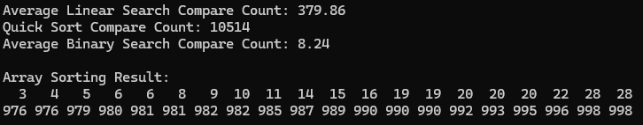

{Result Image}

## 탐색 방식 차이

1. 순차 탐색
   - 배열의 첫 번째 요소부터 시작하여 목표 값에 도달할 때까지 하나씩 비교
   - 평균적으로 순차 탐색의 비교 횟수는 배열 크기의 절반인 n/2번 비교
  
2. 이진 탐색
   - 목표 값을 찾기 위해 배열을 절반씩 나누며 탐색
   - 배열의 크기가 n일 때, 최악의 경우에도 비교 횟수는 log₂n번
  
## 결론
퀵 정렬 후 이진 탐색은 정렬된 배열을 활용해 탐색 범위를 절반씩 좁혀 O(log n)의 효율을 가지지만, 순차 탐색은 처음부터 끝까지 하나씩 비교하므로 O(n)의 시간이 걸립니다. 이 차이로 인해 이진 탐색을 사용하는 것이 훨씬 효율적입니다. 
