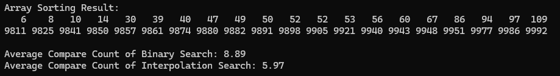

{Result Image}

## 이진탐색과 보간탐색 비교
1. 이진 탐색
   - 배열의 중간값을 기준으로 탐색 범위를 절반으로 줄임.
   - 탐색 속도는 데이터 분포와 관계없이 일정함.
   - 최악의 경우 O(log n)
   - SIZE가 1000일 때, log(1000) ≈ 10번 비교
     
2. 보간탐색
   - 대상 값의 예상 위치를 계산해 직접 접근
   - 탐색 속도는 데이터 분포에 따라 달라짐.
   - 최악의 경우 O(n)
   - SIZE가 1000일 때, log(log(1000)) ≈ 3번 비교
  
## 결론
데이터가 균등하게 분포되어 있는 경우, 보간 탐색이 더 빠릅니다. 
