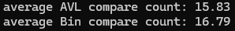
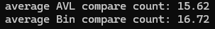
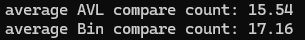

## 주요 차이점
1. AVL 트리
   - AVL 트리는 자체 균형을 유지하도록 설계된 트리
   - 삽입 또는 삭제 시 불균형이 발생하면, 균형 조건을 만족하기 위해 회전 연산을 수행함.
   - 데이터 크기나 삽입 순서에 관계없이 성능이 안정적임.
   - 최악의 경우 O(log n)의 시간 복잡도를 가짐.
  
2. 이진 탐색 트리
   - 이진 탐색 트리는 삽입 순서에 따라 트리의 형태가 변할 수 있음.
   - 삽입 순서에 따라 성능이 크게 달라질 수 있음.
   - 최악의 경우 O(n)의 시간 복잡도를 가짐.
  
